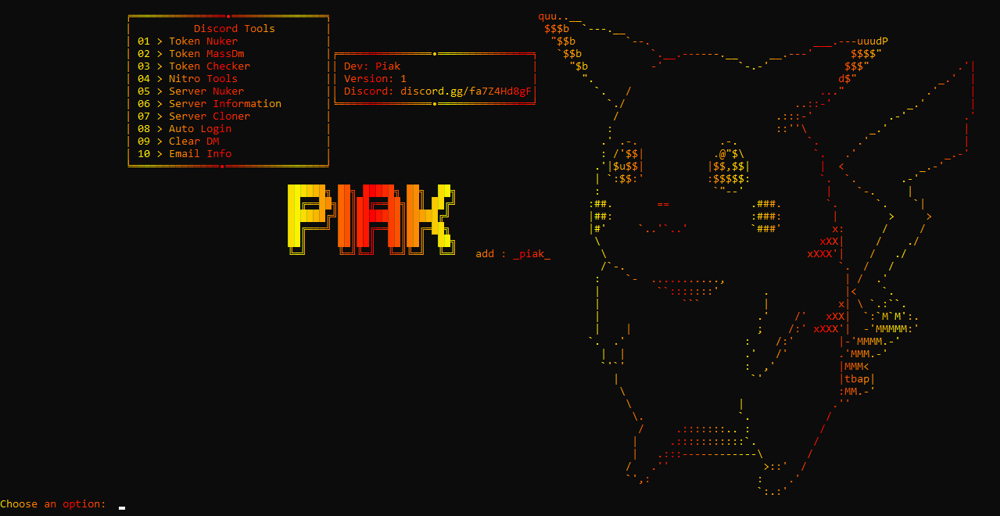

<h1 align="center"> Piak Multi-Tool </h1> 

  
  

<h2>🔗・Informations:</h2>

- Options: Some options are not functional. 
- Code: Obfuscate 
- <a href="https://www.virustotal.com/gui/home/upload">VirusTotal</a> 
<h2>🔗・Credits:</h2>

- <a href="https://discord.gg/wVUMsHAHeJ">Discord</a> 
- <a href="https://www.piaklove.ovh">Website</a> 
- Creator: +Piak_ 
- Version: 1.0

